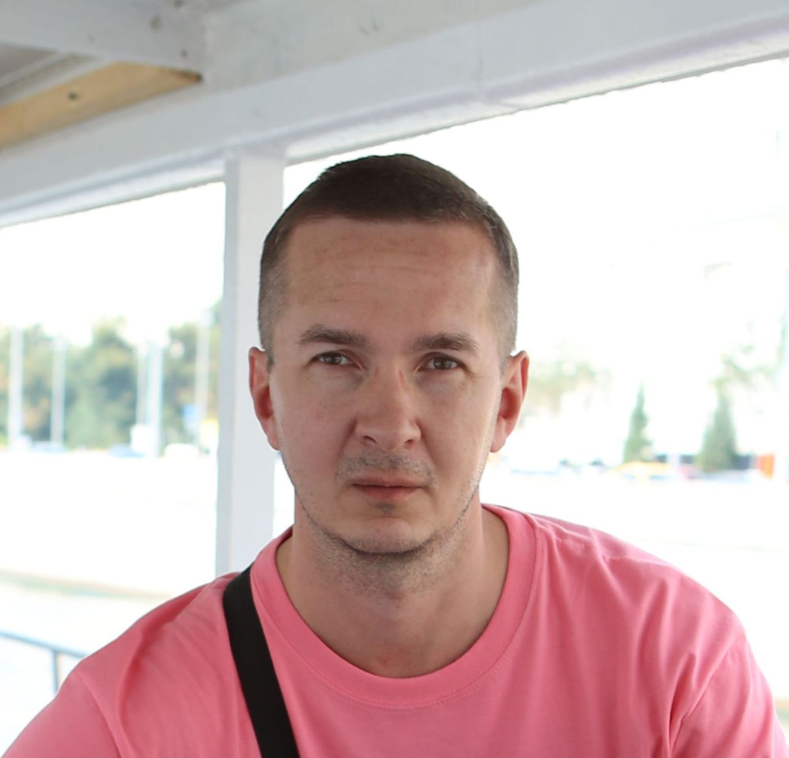

# Немного информации обо мне

1. Меня зовут Алексей
2. Я учусь в [Нетологии](https://netology.ru)
3. Сейчас я выполняю домашнее задание по теме “Командная работа в Git и GitHub. Часть 2”

## фотография: 

